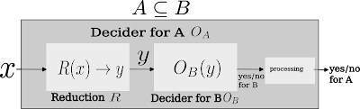

> _This post assumes basic familiarity with Turing machines, P, NP, NP-completeness, decidability, and undecidability. For any formal definitions skipped here, I'd point the reader to Sipser's_ Introduction to the Theory of Computation, _or Arora and Barak's_ Computational Complexity: A Modern Approach.

---

## Introduction

### The What and Why of Reductions

From Archimedes terrorizing the good folk of ancient Syracuse to Newton watching apples fall during a medieval plague, science has always progressed one 'Eureka!' at a time. Romantic as these anecdotes may be, for mathematics, we can hardly look to Mother Nature for providing us the key insight to our proofs.
Therefore, we must develop principled approaches and techniques to solve new and unseen problems. Here is the good part:

> Most unsolved problems we encounter are already related to some existing problem we know about.

This relation to solved problems is something that we can now prod and prick incessantly and eventually use to arrive at a conclusion about new problems. While hardly elegant in its conception, this approach is highly sophisticated in its execution. This is the basis for the mathematical technique known as reduction.

### When can we use reduction techniques?

First we start by describing two types of problems: hard and easy! **Hard problems** are typically those that the problem solver _does not know how to solve_ or _knows are very hard to solve_, while easy problems are simply _easy_ to solve.

Since the notion of hardness as described above is quite subjective and non-rigorous, we formalize it below by quantifying the capabilities of the problem solver.

> Throughout this post, we assume that the notion of _hard_ and _easy_ depends only on the computational resources available to the problem solver.

Access to powerful computational models might allow us (the problem solver) to efficiently find solutions to previously **hard-to-solve** problems. For example, $\mathrm{SAT}$ can be easily solved if we know how to solve the $\mathrm{Halting}$ problem. We shall expand on this example later in this post.

Take two problems[^1], $O$ (_an old problem_) and $N$ (_a new problem_). Suppose we make the astute observation that the underlying mathematical structure of $N$ is similar to $O$. Therefore, instead of trying to solve $N$ from scratch, we can hope to somehow use $O$ to solve $N$. We write $A \subseteq B$ to mean "$A$ reduces to $B$", i.e., instances of $A$ can be transformed into instances of $B$. Consider the following situations of interest that might arise where we would ideally like to avoid reinventing the wheel.

#### Case 1: $O$ is harder to solve than $N$, but $O$ is actually easy to solve

In this case, mathematically, we say that $N\subseteq O$. Our primary approach is to transform instances of $N$ into instances of $O$ and then use the algorithm for $O$ to solve $N$. In other words, if we can demonstrate that $N$ is a special case of $O$, we solve $N$ using our existing knowledge of $O$.

> Reducing problem $A$ to $B$ is the process of transforming instances of $A$ into instances of $B$. Performing this transformation is precisely what establishes $A \subseteq B$.

#### Case 2: $O$ is easier to solve than $N$, but $O$ is actually hard to solve

In this case, we can again exploit the structural similarities between $O$ and $N$, but this time to a different end. Without prior context, it is difficult to show that $N$ is hard to solve. However, using the hardness of $O$, it is easy to show that $N$ is hard to solve as well.

We start with the assumption that $N$ is easy to solve, i.e., there exists some algorithm to efficiently decide membership in the set $N$. We use this assumption to arrive at a contradiction. Now exploiting the similarities between $O$ and $N$, we transform all instances of $O$ to some instance of $N$.

Since $O$ reduces to $N$, there is a way to efficiently decide membership in $O$ using the algorithm for $N$. However, we **know for sure** that $O$ is hard to solve. This leads us to a contradiction, which is resolved by removing our assumption that $N$ is easy to solve. Therefore $N$ has to be hard to solve as well.

Let us explore a few properties of reductions now.

> **Relative Hardness:** For any pair of languages / decision problems $A$ and $B$, if $A \subseteq B$, then $B$ is at least as hard as $A$ to solve, i.e., $A$ _cannot be harder to solve than_ $B$.

### Reductions as relations

- **Reflexivity of reductions:** Trivially $A\subseteq A$ by using identity transformations.
- **Transitivity of reductions:** If $A\subseteq B$ and $B\subseteq C$ then we can prove that $A\subseteq C$ by composing the transformations.
- Reductions are, however, **not symmetric relations** (and, therefore, by extension, not equivalence relations). $A\subseteq B$ does not imply $B\subseteq A$.

A concrete example of this will be discussed later in detail: We can reduce $\mathrm{SAT}$, which is a decidable problem, to the $\mathrm{Halting}$ problem, which is an undecidable problem, but the converse is not true (by definition of decidability).

---

## An alternate view of reductions

Reductions are a highly general family of techniques, and to provide a rigorous formalization of reductions, we consider some specific variants. An interesting way of looking at reductions is as follows:

> Given an **oracle** for a problem $B$, can we solve $A$ efficiently by making oracle calls to $B$? If yes, then $A\subseteq B$.

Here, an oracle is nothing but a _black-box subroutine_ for efficiently solving a problem. The beauty of reductions lie in the fact that we do not need to bother about the internal mechanisms of the oracle itself. Nor do we have to worry about constructing the oracle itself. **We simply have to use the oracle's existence**. Concretely, suppose $A\subseteq B$. The reduction proceeds in two steps:

- Suppose there exists a subroutine $R$ that transforms **yes instances** of $A$ into **yes instances** of $B$, and **no instances** of $A$ into **no instances** of $B$. First, input instances $x$ (that may/may not belong to $A$) are reduced/transformed into _possible instances_ of $B$ using the subroutine $R$.
- Next, we perform invocation(s) to the oracle for $B$ to decide the membership of $R(x)$ in $B$. Explicitly, we perform the following computation: $O_B(R(x))$. If $O_B(R(x))=1$, then we decide that $x\in A$. Otherwise, we decide that $x\notin A$.

$$x\in A \iff R(x) \in B.$$



The notion of efficiency is twofold.

- Firstly, we are concerned with **how efficient the transformation/reduction** from $x$ to $R(x)$ is. There is a small caveat here: only the construction of the reduction method $R$ needs to be efficient, and solving $O_B(R(x))$ does not need to be efficient. We explore this distinction concretely in the example below.
- Sometimes, we might require more than one call to the oracle $O_B$, depending on the problems at hand. In this case, we are concerned with **how many times the oracle is invoked**.

### Example of an "efficient" reduction

Consider the following C pseudocode:

```C
int A(int x){
 for(;x>12;x++);
 return x;
}
```

<span style="color: red;">Writing this piece of code took finite time, and was certainly efficient. However, depending on the value of the input the `for` loop will never terminate for values of $x>11$.</span> Therefore, this program may become _inefficient during runtime_. The notion of efficiency we consider during reductions (**unlike computational scenarios**) is how efficiently we can write the code for function `A`, and not how efficiently `A` transforms $x$ into $R(x)$. This distinction is what makes reductions useful: we are not running $R(x)$, merely constructing it.

---

## A Prototypical Reduction: SAT to the Halting Problem

### The Halting Problem

Recall the earlier piece of pseudocode with a slight modification.

```C
int A1(int x){
 for(;x>12;x++);
 return x;
}
int A2(int x){
 for(;x>12;x--);// This loop will always terminate
 return x;
}
```

Note `A2` will always halt no matter the input, while `A1` may never halt depending on the input.

Imagine you would like to design a function $B$ that takes the binary description of any single parameter function $A$ and any arbitrary input $x$, and find out whether $A$ will halt on input $x$.

> **The Halting problem ($\mathrm{HALT}_{TM}$):** Given (the binary encoding of) any arbitrary Turing Machine $A$ and an arbitrary input (encoded as a binary string) $x$, does $A(x)$ halt? We denote this problem $\mathrm{HALT}_{TM}$, where the subscript emphasises that the input is a Turing machine description rather than an arbitrary program.

This in effect describes the Halting problem, where $B$ is a universal Turing machine and $A$ can be any Turing Machine. It has been shown that there does not exist any such $B$ which solves this problem. Therefore the Halting problem cannot be decided, and is formally referred to as an **undecidable** problem.

### The SAT Problem

A Boolean formula $f$ accepts as input an $n$-bit string and outputs a $1$ (if it accepts the string), or a $0$ (if it rejects the string). Mathematically, $f:\{0,1\}^{n}\to\{0,1\}$.

> **The satisfiability ($\mathrm{SAT}$) problem:** Given a Boolean formula $f$, does there exist an $x \in \{0,1\}^n$ such that $f(x) = 1$?

The key observation is that we can encode a $\mathrm{SAT}$ instance as a Turing machine that halts if and only if the formula is satisfiable.

Even though $\mathrm{SAT}$ can be quite hard to solve computationally (it may have exponential runtime depending on the structure of the formula), we can **always** construct an algorithm to solve it. Therefore, right off the bat, we observe that $\mathrm{SAT}$ is easier to solve (it is decidable) than the $\mathrm{Halting}$ problem.

### Reducing SAT to HALT

Let us finally have a look at how we would reduce $\mathrm{SAT}$ to $\mathrm{HALT}_{TM}$.

1. Our input $x$ is a Boolean formula. We want to output if this formula is satisfiable.
2. We construct a TM (Turing Machine) $T$ which accepts $x$ and does the following:
   - $T$ iterates over all possible assignments to find a satisfying assignment. This may require exponential runtime in the size of the formula.
     - If $T$ finds a satisfying assignment, halt and return 1. Hence, if $x$ is satisfiable, $T$ halts.
   - Otherwise, we put $T$ into an infinite loop. Hence, $T$ halts iff $x$ is satisfiable.
3. Our reduction $R(x)=\langle\langle T\rangle,x\rangle$ takes the $\mathrm{SAT}$ formula $x$ and returns an **encoding** of the above Turing machine $T$ coupled with $x$, such that yes instances of $\mathrm{SAT}$ map to yes instances of $\mathrm{HALT}_{TM}$, and no instances of $\mathrm{SAT}$ map to no instances of $\mathrm{HALT}_{TM}$. Note that $R(x)$ at this point can be compared to a compiled binary which has not yet been executed.
4. We pass $R(x)$ to $O_{\mathrm{HALT}_{TM}}$.
   - If $O_{\mathrm{HALT}_{TM}}(R(x))$ returns yes, this implies $T$ halts on input $x$, which in turn implies $x$ has a satisfying assignment. Therefore $R(x)\in\mathrm{HALT}_{TM}\implies x\in\mathrm{SAT}$.
   - If $O_{\mathrm{HALT}_{TM}}(R(x))$ returns no, then $T$ does not halt on input $x$, which implies that $x$ does not have a satisfying assignment. Therefore $R(x)\notin\mathrm{HALT}_{TM}\implies x\notin\mathrm{SAT}$. We can take the contrapositive to obtain $x\in\mathrm{SAT}\implies R(x)\in\mathrm{HALT}_{TM}$.

Once again we note the following ([recall this](#example-of-an-efficient-reduction)).

> In step 2, we are simply constructing the TM $T$, not executing it. Think of this as writing a C or Java program/executable for $T$. However, we are never actually going into runtime; i.e. executing the executable at any point.

The reduction is the transformation of the $\mathrm{SAT}$ formula $x$ to an encoding of both the Turing Machine and the $\mathrm{SAT}$ formula, which is an instance of $\mathrm{HALT}_{TM}$.

---

## Taxonomy of Polynomial-time reductions

In this post, we only consider polynomial-time **deterministic** reductions, where both the time taken to transform $x$ to $R(x)$ using a DTM, and the number of calls to $O_B$, are polynomial. These are the _most commonly studied types of reductions_,[^note] and we look at three kinds of polynomial-time reductions.

---

### Karp Reductions / Many-one reductions

These are the **most restrictive type** of polynomial reductions.
Given a single input $x$, $R(x)$ produces a single instance $y$ such that $x\in A\iff y\in B$. Therefore, we have to perform only one oracle call to $O_B$. The earlier reduction from $\mathrm{SAT}$ to $\mathrm{HALT}_{TM}$ was a Karp reduction.

We can restrict Karp reductions further by requiring the transformation $R$ to be computable in even weaker models. For example, in logspace many-one reductions, we can compute $R(x)$ using just logarithmic space instead of polynomial time. Even more restrictive notions of reductions consider reductions computable by constant depth circuit classes.

---

### Truth Table Reductions

These are reductions in which given a single input $x$, $R(x)$ produces a constant number of instances $y_1, y_2, \ldots, y_k$ of $B$. The output $O_A(x)$ can be expressed in terms of a Boolean combination function $f:\{0,1\}^k\to\{0,1\}$ that combines the oracle answers $O_B(y_i)$ for $i\in[1,\ldots,k]$, where $f$ outputs $1$ for a yes instance of $A$ and $0$ otherwise.[^note4]

$$ x\in A\iff f\left(y_1\in B, y_2\in B,\ldots,y_k\in B\right)=1 $$

Let us consider an example. Consider two problems on a graph $G$ with a constant number of vertices $\ell$.

> $A$: What is the minimum sized independent set for $G$?
> $B$: Does $G$ have an independent set of size $k$?

The reduction $A\subseteq B$ would involve looping from $1$ to $\ell$ and querying $B$ each time. The combination function would be an OR function. At the first yes instance of $B$, we return the value as the answer for $A$. If there is no independent set in $G$, the worst number of calls to $O_B$ is $\ell$.

---

### Cook Reductions / Poly-time Turing Reductions

Here, we are allowed a polynomial number of oracle calls and polynomial time for transforming the inputs. These are the most general form of reductions, and the other forms of reductions are restrictions of Cook reductions. In the example graph $G$ used for TT reductions, if we assume the number of vertices of $G$ to be a polynomial, then the reduction $A\subseteq B$ using the same exact process would be a Cook reduction.

We denote these three kinds of reductions as follows, where $\subseteq_{m}$ denotes Karp reductions, $\subseteq_{t}$ denotes Truth Table reductions, and $\subseteq_{T}$ denotes Cook reductions:

> $A\subseteq_{m} B \implies A\subseteq_{t} B \implies A\subseteq_{T} B$

**Note:** From the nature of the examples, we can see that Karp reductions only extend to decision problems (problems with yes/no outputs). In contrast, Cook reductions can accommodate search/relation/optimization problems (problems with a set of outputs).

---

## Basic reductions in Computability Theory

In this section, the reader is assumed to have familiarity with concepts of decidability and undecidability. Let us now proceed with some instances of reductions in computability theory.

Let $A\subseteq B$, and they are decision problems.

| If $A$ is...   | Then $B$ may be...                        |
| -------------- | ----------------------------------------- |
| decidable      | decidable, semi-decidable, or undecidable |
| semi-decidable | semi-decidable or undecidable             |
| undecidable    | undecidable                               |

The third case is of interest here. To show that $B$ is undecidable, we must find a reduction from $A$ to $B$, where $A$ is already known to be undecidable.

> **Note:** The reduction function $R$ must itself be computable. An uncomputable reduction would be circular: we would be assuming computational power beyond what we are trying to establish.

Now again, consider $A\subseteq B$ where they are decision problems. We can conclude the following:

- If $B$ is decidable, $A$ is decidable.
- If $B$ is semi-decidable, $A$ is semi-decidable.
- If $A\subseteq B$, then $\bar{A}\subseteq \bar{B}$, where $A$ and $B$ are decidable problems.

The first two statements follow directly from the definition of reductions, and their contrapositives follow immediately.[^contrapositive]

And just like that, we see the power of formalizing the notion of reductions.

---

## Complexity-Theoretic notions

A complexity class is a set of computational problems that can be solved using similar amounts of bounded resources (time, space, circuit depth, number of gates, etc.) on a given computational model (Turing machines, circuits, cellular automata, etc.).

The complexity classes $\mathrm{P}$, $\mathrm{NP}$, and $\mathrm{PSPACE}$ are closed under Karp and logspace reductions. The complexity classes $\mathrm{L}$ and $\mathrm{NL}$ are closed only under logspace reductions. Closure means the following: given a decision problem $A$ in a complexity class $C$, any problem $B$ such that $B\subseteq A$ is also in $C$.

We now explore two interesting notions in complexity theory that arise from reductions.

### Completeness

For a bounded complexity class,

> Complete problems are the hardest problems inside their respective complexity class.

A more formal definition of completeness is as follows:

> Given a complexity class $C$ which is closed under reduction $r$, if there exists a problem $A$ in $C$ such that all other problems in $C$ are $r$-reducible to $A$, $A$ is said to be $C$-complete.

For example, an $\mathrm{NP}$-complete problem is in $\mathrm{NP}$, and all problems in $\mathrm{NP}$ are Karp-reducible to it. The notions of $\mathrm{PSPACE}$-completeness and $\mathrm{EXPTIME}$-completeness are similarly defined under Karp-reductions.

The role of reductions in this context can be understood through $\mathrm{P}$-completeness. Consider any non-trivial decision problem in $\mathrm{P}$ (trivial problems are akin to constant functions). Every other non-trivial decision problem is Karp-reducible to it. Therefore every non-trivial decision problem is $\mathrm{P}$-complete under Karp-reductions. In other words, $\mathrm{P}$-completeness under Karp-reductions collapses to $\mathrm{P}$ itself, making the notion of a "hardest problem in $\mathrm{P}$" meaningless. This definition is essentially the same as $\mathrm{P}$ (minus the empty language and $\Sigma^\star$).

Therefore, we come to the following conclusion:

> Under Karp-reductions, the notion of $\mathrm{P}$-completeness is _semantically useless_.

Hence, we use weaker forms of reductions such as logspace reductions or reductions using constant depth circuit computable functions to achieve a more meaningful notion of $\mathrm{P}$-completeness.[^note3]

### Self reducibility

Decision problems are yes/no problems where we ask if a solution exists. However, sometimes we also want to solve the corresponding search problem to find a solution (if one exists).

In the context of languages in $\mathrm{NP}$, self-reducibility essentially states that if we can efficiently solve the decision version of a problem, we can also efficiently solve the search/optimization version of the problem. A more formal definition would be as follows:

> The search version of a problem Cook-reduces (polynomial-time Turing-reduces) to the decision version of the problem.

**Fact:** Every $\mathrm{NP}$-complete problem is self-reducible and _downward_ self-reducible (informally, the search space can be pruned by making queries on smaller instances)[^note2].

## Conclusion

This write-up aims to demystify a core technique used in theoretical computer science and provide a few contexts for its usage. For a more rigorous and formal introduction to this topic, please check out Michael Sipser's excellent book "An Introduction to the Theory of Computation." There are many more things to say about reductions, and this article barely scratches the surface on any of the topics it touches. However, I feel it would be prudent to stop at this point before it becomes any more of a rambling mess than it already is.[^halt]

# Footnotes

[^1]: Formally, we consider problems $O$ and $N$ to be _languages_ or sets of strings corresponding to decision problems, i.e., YES/NO problems.

[^note]: We will look at the notion of *randomized* reductions in another post.

[^note3]: We will look at weaker notions of reductions in another post.

[^note2]: We will look at the notions of self-reducibility and downward self-reducibility [in another post](https://chatsagnik.github.io/post.html?file=posts%2Fselfreductions%2Findex.md).

[^note4]: We will look at the notion of randomized reductions and their combination functions in another post.

[^contrapositive]: Explicitly: if $A$ is not decidable then $B$ is not decidable, and if $A$ is not semi-decidable then $B$ is not semi-decidable. The proof of the third statement is as follows: $x\in \bar{A} \iff x\notin A \iff R(x)\notin B \iff R(x)\in\bar{B}$, and therefore $x\in \bar{A} \iff R(x)\in\bar{B}$, establishing $\bar{A}\subseteq\bar{B}$.

[^halt]: Whether this post itself [halts](https://chatsagnik.github.io/halts/index.md) is left as an exercise to the reader.
